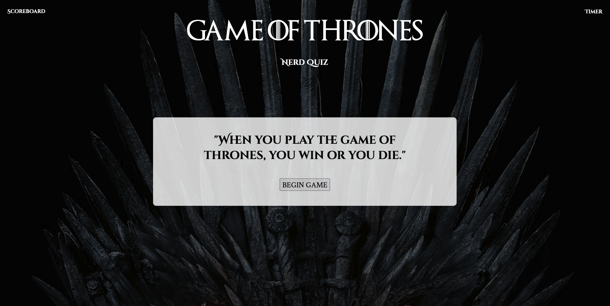
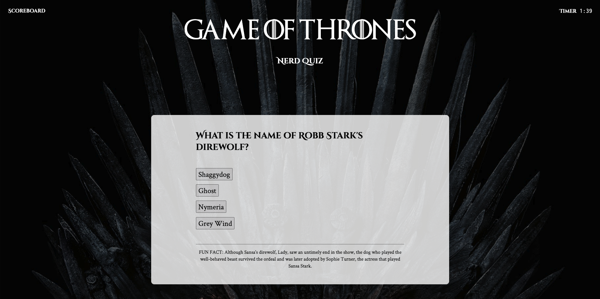
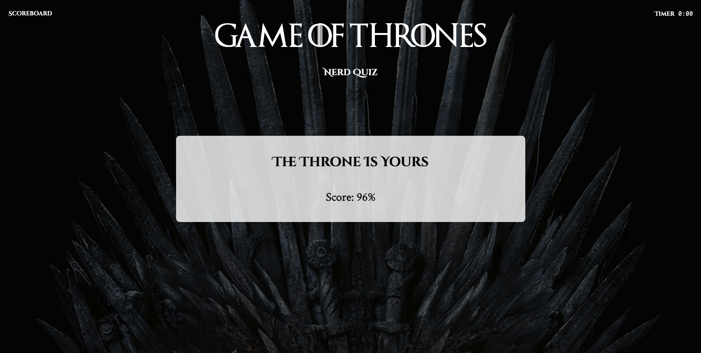

# Game of Thrones Quiz

## Table of Contents
* [Project Summary](##project-summary)
* [Technologies Used](##technologies-used)
* [Example Code](##example-code)
* [How to Access](##how-to-access)
* [About Me](##about-me)
* [Screenshots](##screenshots)
* [Give Credit Where It's Due](##resource-reference)
---

## Project Summary
This is a Game of Thrones themed quiz consisting of 20 questions and set to a timer. Wrong answers will decrease the timer. Correct answers will be scored and a percentage will display at the end. Player names and scores are stored for reference and can be called upon by clicking on the scoreboard.

## Technologies Used
* [JavaScript](https://developer.mozilla.org/en-US/docs/Web/JavaScript)
* [HTML5](https://developer.mozilla.org/en-US/docs/Web/Guide/HTML/HTML5)
* [CSS3](https://developer.mozilla.org/en-US/docs/Archive/CSS3)

## Example Code
Retrieve data from an array of objects.
```
function getQuizObjects() {
    if (answerList.length < quizList.length) {
        h1Tag.textContent = quizList[quizProgress].q;
        b1Tag.textContent = quizList[quizProgress].a[0];
        b2Tag.textContent = quizList[quizProgress].a[1];
        b3Tag.textContent = quizList[quizProgress].a[2];
        b4Tag.textContent = quizList[quizProgress].a[3];
        h2Tag.textContent = quizList[quizProgress].footnote;
    }
}
```
Record button behaviors with event listeners.
```
function recordAnswerB1() {
    answerList.push(b1Tag.textContent);
    if (answerList[quizProgress] === quizList[quizProgress].correct) {
        pointsTotal += quizList[quizProgress].points;
    } else {
        timeSec -= 5;
    }
    if (answerList.length === quizList.length) {
        endGame();
        displayResults();
    }
    quizProgress++;
}
```
```
b1Tag.addEventListener("click", recordAnswerB1);
```
Write to local storage ...
```
function writeToStorage() {
    var player = {name: inputField.value, score: Math.round(((pointsTotal/pointsPossible)) * 100)};
    scoreHist.push(player);
    localStorage.setItem("scores", JSON.stringify(scoreHist));
}
```
... and retrieve from local storage.
```
function retrieveFromStorage() {
    if (localStorage === "") {
        return;
    } else {
        scoreHist = JSON.parse(localStorage.getItem("scores")) || [];
    }
}
```
Append & remove elements, and track player scores.
```
function displayScoreboard() {
    h1Res.removeChild(aTag);
    divA.removeChild(h2Res);
    divF.removeChild(h3Res);
    divA.appendChild(scoreCard);
    // retrieveFromStorage();
    for (var i = 0; i < 5; i++) {
        var player = document.createElement("li");
        scoreCard.appendChild(player);
        player.textContent = scoreHist[i].name + " - " + scoreHist[i].score +"%";
    }
}
```


## How to Access
[Game of Thrones Quiz](https://profjjk.github.io/GoT-Quiz/)

## About Me
* [LinkedIn](www.linkedin.com/in/the-real-jordan-kelly)
* [GitHub](https://github.com/profjjk)

## Screenshots




## Resource Reference
Images:
* [Background Image](https://media1.popsugar-assets.com/files/thumbor/RULArzi8uqr7dtQN78pzJIG1MBc/fit-in/2048xorig/filters:format_auto-!!-:strip_icc-!!-/2020/04/08/960/n/1922507/c39129f5495d5fb5_game_of_thrones/i/Game-Thrones-Zoom-Background.jpg)

Custom font:
* [Game of Thrones font](https://fontmeme.com/fonts/game-of-thrones-font/)
* [Font Squirrel](https://www.fontsquirrel.com/)

Quiz questions:
* [Clay's Quiz](https://www.allthetests.com/tests-for-the-real-fan/books-quizzes/other-books/quiz31/1418776957/game-of-thrones-book-1-5-quiz)
* [Jinny's Quiz](https://www.goodreads.com/quizzes/9484-a-song-of-ice-and-fire-quiz)
* [The Guardian's Quiz](https://www.theguardian.com/tv-and-radio/quiz/2015/apr/11/game-of-thrones-quiz)

Fun facts & quotes:
* [GoT fun facts](https://www.boredpanda.com/game-of-thrones-facts/?utm_source=google&utm_medium=organic&utm_campaign=organic)
* [GoT quotes](https://reedsy.com/discovery/blog/best-game-of-thrones-quotes)